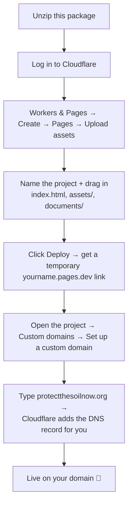

# How to publish the site to your Cloudflare domain

This guide assumes you **already own your domain (protectthesoilnow.org) and it is
already managed in your Cloudflare account**. If that's true, the easiest path needs
no coding tools and no GitHub — you upload the files through the Cloudflare website
and point your domain at them.

> **About screenshots:** Cloudflare changes its dashboard layout every few months, so
> printed screenshots go out of date fast. Rather than ship images that might not
> match what you see, the steps below name the exact buttons to click, and each
> section links to **Cloudflare's own official guide**, which always has current
> screenshots. If you'd like me (or whoever set this up) to record a short screen
> walkthrough against *your* account, that's the most reliable "with pictures"
> option — ask for it.

---

## The big picture



---

## Option A — Upload through the Cloudflare website (recommended)

**No terminal, no GitHub. ~10 minutes.**
Official guide with screenshots: <https://developers.cloudflare.com/pages/get-started/direct-upload/>
Custom domains: <https://developers.cloudflare.com/pages/configuration/custom-domains/>

### Step 1 — Unzip the package
Unzip the file you were given. You'll get the `protect-the-soil-now` folder shown in
the main [`README.md`](../README.md).

### Step 2 — Open Cloudflare Pages
1. Go to <https://dash.cloudflare.com> and log in.
2. In the left sidebar, click **Workers & Pages**.
3. Click **Create application**, then the **Pages** tab, then
   **Upload assets** (not "Connect to Git").

### Step 3 — Create the project and upload the files
1. Enter a project name, e.g. `protect-the-soil-now`, and click **Create project**.
2. Drag the files into the upload box. **Upload only these three items** (the actual
   website), and skip the developer files:
   - ✅ `index.html`
   - ✅ the `assets` folder
   - ✅ the `documents` folder
   - ❌ skip `docs`, `README.md`, `wrangler.jsonc`, `.assetsignore`, `.gitignore`
     (these are just for editing/deploying — no need to publish them)

   > Tip: the upload box wants the **contents** of the folder, with `index.html` at
   > the top level — not the outer `protect-the-soil-now` folder itself.
3. Click **Deploy site**.

Cloudflare gives you a temporary address like `protect-the-soil-now.pages.dev`.
Open it — the site is already live there. Now attach your real domain.

### Step 4 — Point your domain at it
1. In your new Pages project, open the **Custom domains** tab.
2. Click **Set up a custom domain**.
3. Type `protectthesoilnow.org` and confirm. Because the domain is already in your
   Cloudflare account, Cloudflare adds the required DNS record **automatically** —
   you don't have to configure anything by hand.
4. (Optional) Repeat for `www.protectthesoilnow.org` so both work.

Give it a minute or two. The domain will show **Active**, and
`https://protectthesoilnow.org` will serve the site with HTTPS handled automatically.

### Updating the site later
Make your edits (see [`EDITING.md`](EDITING.md)), then in the Pages project open the
**Deployments** tab → **Create deployment** (or **Upload**) → drag the updated files
in again. The new version replaces the old one within seconds. If your browser still
shows the old version, do a hard refresh (**Cmd-Shift-R** / **Ctrl-Shift-R**).

---

## Option B — Auto-publish from GitHub (nice once you're set up)

If you'd rather have the site update automatically every time you save a change, put
this folder in a GitHub repository and connect it:

1. Create a new repository on GitHub and upload these files to it.
2. In Cloudflare: **Workers & Pages → Create → Pages → Connect to Git**, and select
   the repo.
3. Leave the build command **empty** and set the output directory to `/` (there's no
   build step — the files are served as-is).
4. Add your custom domain exactly as in Option A, Step 4.

After that, every change you push to GitHub redeploys the site on its own.
Official guide: <https://developers.cloudflare.com/pages/get-started/git-integration/>

---

## Option C — Command line (advanced / optional)

This package includes a `wrangler.jsonc` file already configured (project name
`protect-the-soil-now`) so a developer can deploy it as a Cloudflare Worker from a
terminal:

```bash
npx wrangler deploy
```

This requires Node.js and a Cloudflare login via `npx wrangler login`. Most people
should use Option A instead — this is here only for whoever is comfortable with a
command line.

---

## Troubleshooting

| Symptom | Fix |
|---|---|
| Domain stuck on "Verifying" / not going Active | Wait a few minutes; confirm the domain is in **the same** Cloudflare account as the Pages project. |
| Site shows an old version after an update | Hard refresh: **Cmd-Shift-R** (Mac) / **Ctrl-Shift-R** (Windows). |
| "Download" button gives a 404 | The PDF wasn't uploaded, or its filename doesn't match the link. See [`../documents/README.md`](../documents/README.md). |
| Hero shows a plain color, no photo | `hero.jpg` wasn't uploaded into `assets/images/`. See [`../assets/images/README.md`](../assets/images/README.md). |
| Comment button does nothing | The visitor needs a default email app configured (Mail, Outlook, Gmail app). On a work computer with no mail app, it may not open. |

---

## Who pays / who owns it

The site is hosted on **your** Cloudflare account, on **your** domain. Cloudflare
Pages' free tier is generous and this site is tiny, so hosting is almost certainly
free. Nothing about the hosting or the domain depends on anyone outside your group.
